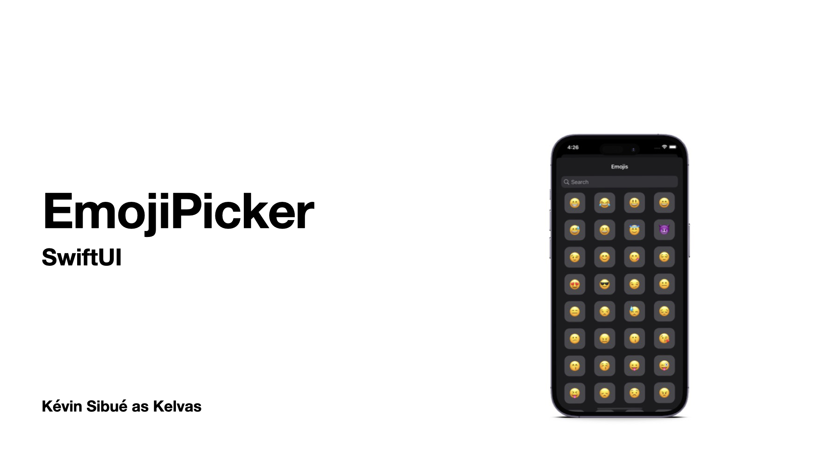
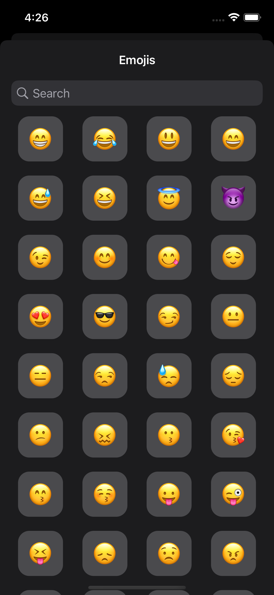
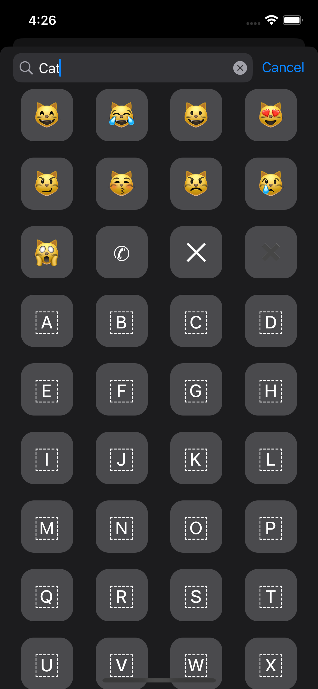

## Goal

In some cases you need to be able to select an emoji and not allow a user to enter anything else (letters, numbers, symbols, ...). 

The EmojiPicker is there for that.

It is a SwiftUI library that allows you to get a list of all the emojis present on your smartphone but also to create a selector to simplify your life.

## Screenshots and video

|Emoji list|Emoji search|
|---|---|
|||


## Dependencies

- SwiftUI (iOS >= 15.0)
- [Smile](https://github.com/onmyway133/Smile) (2.1.0)

## How install it?

Nowaday we only support Swift Package Manager. You can use build-in UI tool for XCode with this search words: `EmojiPicker` or you can add it directly with this following command :

```swift
.package(url: "https://github.com/Kelvas09/EmojiPicker.git", from: "1.0.0")
```

## How use it?

First of all you have to import the library `EmojiPicker`:

```swift
import EmojiPicker
```

You then have the option of using the `EmojiPickerView`. This view represents the list of selectable emojis.

The latter is not embedded in a NavigationView. If you want to display it with a title, you have to do it yourself:

```swift
...
NavigationView {
    EmojiPickerView(selectedEmoji: $selectedEmoji, selectedColor: .orange)
        .navigationTitle("Emojis")
        .navigationBarTitleDisplayMode(.inline)
}
...
```

Here is a complete example:

```swift
import SwiftUI
import EmojiPicker

struct ContentView: View {

    @State
    var selectedEmoji: Emoji?

    @State
    var displayEmojiPicker: Bool = false

    var body: some View {
        VStack {
            VStack {
                Text(selectedEmoji?.value ?? "")
                    .font(.largeTitle)
                Text(selectedEmoji?.name ?? "")
                    .font(.title3)
            }
            .padding(8)
            Button {
                displayEmojiPicker = true
            } label: {
                Text("Select emoji")
            }
        }
        .padding()
        .sheet(isPresented: $displayEmojiPicker) {
            NavigationView {
                EmojiPickerView(selectedEmoji: $selectedEmoji, selectedColor: .orange)
                    .navigationTitle("Emojis")
                    .navigationBarTitleDisplayMode(.inline)
            }
        }
    }

}
```

### Select color

When a user selects an emoji, it is highlighted. By default the selection color is `blue` but you can change this value when creating the view: 

```swift
EmojiPickerView(selectedEmoji: $selectedEmoji, selectedColor: .orange)
```

### Enable search

By default the search for emoji is allowed in the picker, it is however possible to change this setting when creating the view:

```swift
EmojiPickerView(selectedEmoji: $selectedEmoji, searchEnabled: false)
```

## Samples

You can access to sample project on folder `EmojiPickerSample`
